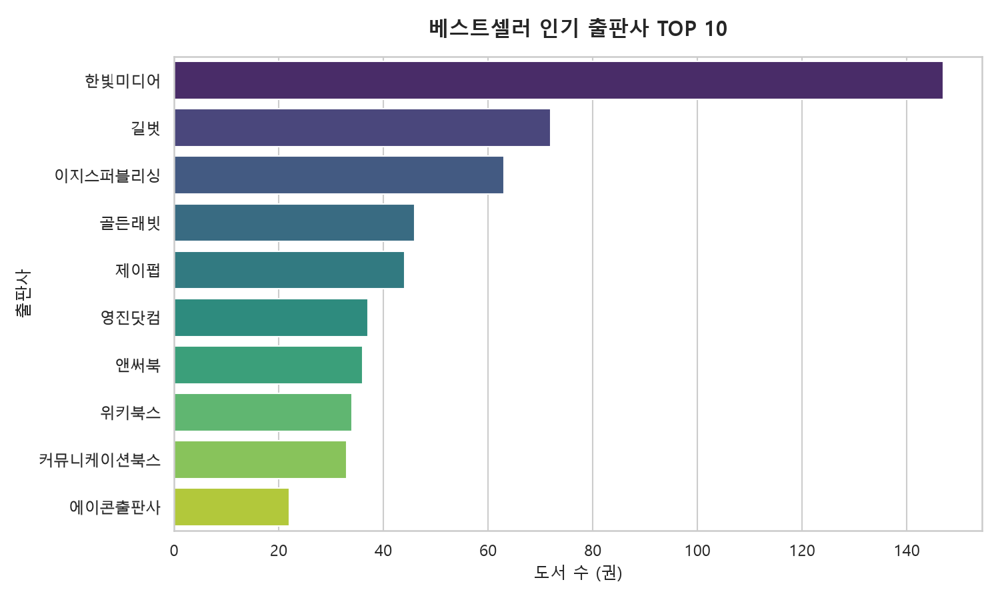
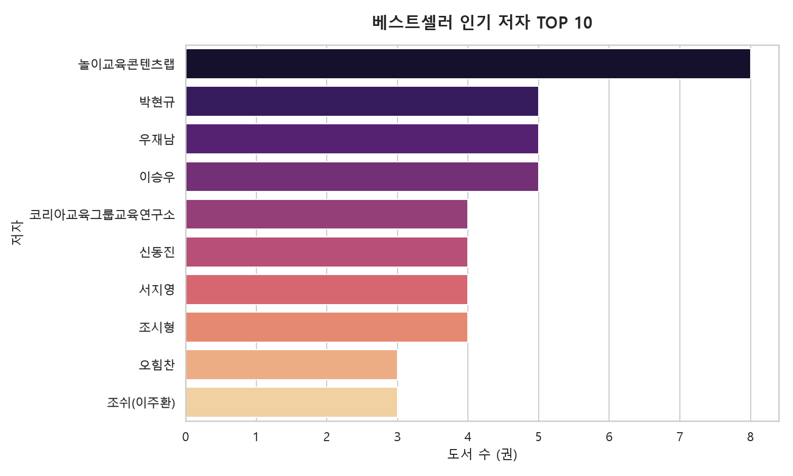
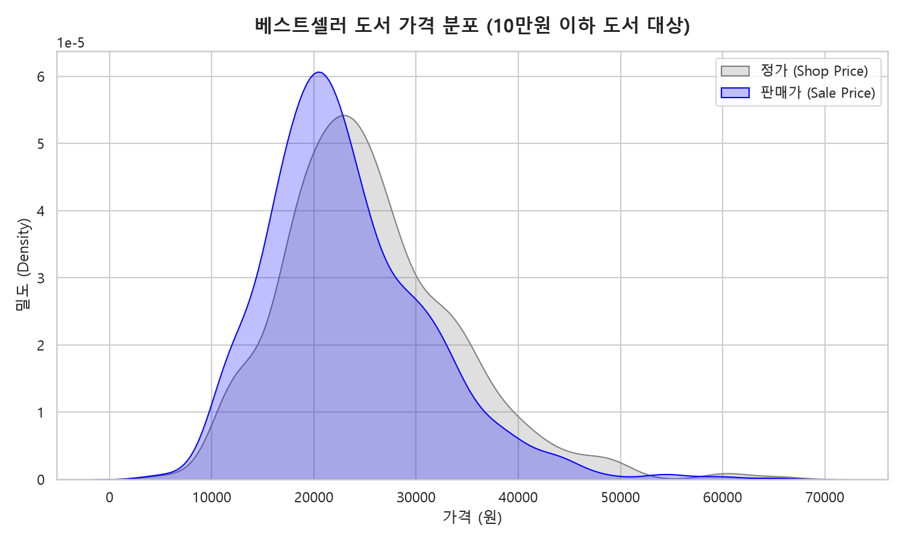
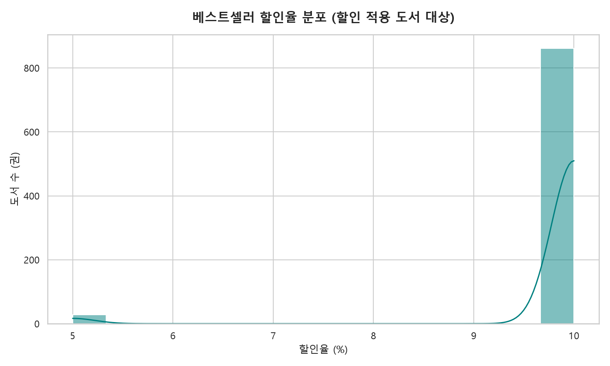
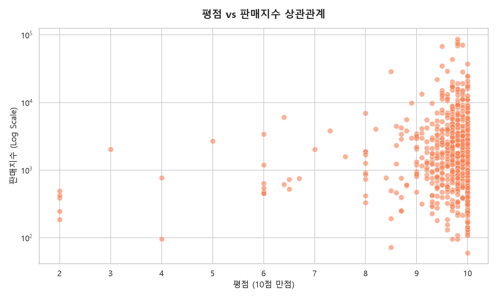

# YES24 IT/모바일 베스트셀러 데이터 EDA 분석 보고서

본 보고서는 YES24 IT/모바일 베스트셀러 카테고리에서 수집한 총 **1,000개**의 도서 데이터를 바탕으로 수행한 탐색적 데이터 분석(EDA) 결과입니다.

---

## 📊 1. 핵심 요약 지표 (KPIs)

| 지표명 | 수치 | 설명 |
| :--- | :---: | :--- |
| **분석 대상 도서 수** | 1,000 권 | 카테고리 전체 베스트셀러 도서 |
| **평균 정가** | 25,466 원 | 도서 정가의 평균값 |
| **평균 판매가** | 23,233 원 | 실판매가의 평균값 |
| **평균 할인율** | 8.8% | 정가 대비 할인 비율의 평균값 |
| **평균 평점** | 9.60 / 10 | 평점이 있는 도서들의 평균 점수 |
| **총 회원 리뷰 건수** | 19,337 건 | 수집된 도서들에 등록된 리뷰 총합 |
| **평균 판매지수** | 3,012.8 | 도서 인기도를 나타내는 YES24 판매지수 평균 |

---

## 🏆 2. 주요 하이라이트 도서

### 🔥 최고 판매지수 도서 (인기 1위)
* **도서명**: 요즘 교사를 위한 AI 수업 활용 가이드 with 2022 개정 교육과정
* **저자/출판사**: 박진환,공지훈,서원진공 / 한빛미디어
* **판매지수**: 87,078
* **가격**: 정가 20,000원 → 판매가 18,000원 (10% 할인)
* **평점/리뷰**: 9.8점 (리뷰 65건)

### ⭐ 최고 평점 도서 (리뷰 10건 이상 기준)
* **도서명**: 클로드 코드로 시작하는 실전 에이전틱 코딩
* **저자/출판사**: GoosKim / 더 타이즈
* **평점**: 10.0 / 10 (리뷰 11건)
* **판매지수**: 24,849

---

## 📈 3. 데이터 시각화 분석

### 🏢 ① 인기 출판사 TOP 10
베스트셀러 목록에 가장 많은 도서를 올린 상위 10개 출판사 분포입니다.

> [!NOTE]
> **출판사 시장 점유**: 베스트셀러 목록 내에서 특정 출판사들의 도서 점유율이 높게 나타납니다. 상위 출판사들은 IT 모바일 분야의 베스트셀러 트렌드를 주도하고 있음을 확인할 수 있습니다.

### ✍️ ② 인기 저자 TOP 10
베스트셀러에 가장 많은 작품을 올린 상위 10개 저자 분포입니다.

---

### 💵 ③ 도서 가격 분포 (정가 vs 판매가)
도서들의 원래 정가(Shop Price)와 실제 할인이 적용된 판매가(Sale Price)의 밀도 분포입니다.

> [!TIP]
> **주요 가격대 분석**: 대부분의 베스트셀러 도서는 20,000원 ~ 30,000원 선에 집중 분포하고 있으며, 할인이 적용되면서 전체적인 분포 곡선이 왼쪽(낮은 가격대)으로 평행 이동한 것을 볼 수 있습니다.

### 🏷️ ④ 도서 할인율 분포
도서에 적용되는 할인율의 빈도 분포입니다.

> [!IMPORTANT]
> **할인율 평준화**: 대다수의 도서가 도서정가제의 영향 하에 **10%** 부근의 표준 할인율을 적용받고 있음을 명확하게 보여줍니다.

---

### 💬 ⑤ 평점과 판매지수의 상관관계
도서 평점(10점 만점)과 인기도(판매지수, 로그 스케일) 간의 관계를 보여주는 산점도입니다.

> [!NOTE]
> **상관관계 해석**: 평점과 판매지수 간에는 단순 비례적인 강력한 양의 상관관계는 관찰되지 않습니다. 이는 평점이 높다고 해서 무조건 많이 판매되는 것은 아니며, 대중적인 인지도(리뷰 수)나 마케팅 요소가 판매지수에 복합적으로 작용함을 나타냅니다.

---

## 📅 4. 출판 동향 및 기타 인사이트
* **최근 출판 경향**: 최근 5개년 출판 도서 비중 (2026년(351권), 2025년(303권), 2024년(198권), 2023년(54권), 2022년(27권))이 압도적으로 높아, IT 기술 분야 특성상 최신 트렌드를 반영한 도서들이 베스트셀러에 신속하게 진입하고 유지되는 경향을 보입니다.
* **분철 서비스**: 전체 분석 대상 도서 중 **15.3%**의 도서가 분철 서비스를 지원하여, 두꺼운 IT 전공 도서의 학습 편의성을 돕고 있습니다.
